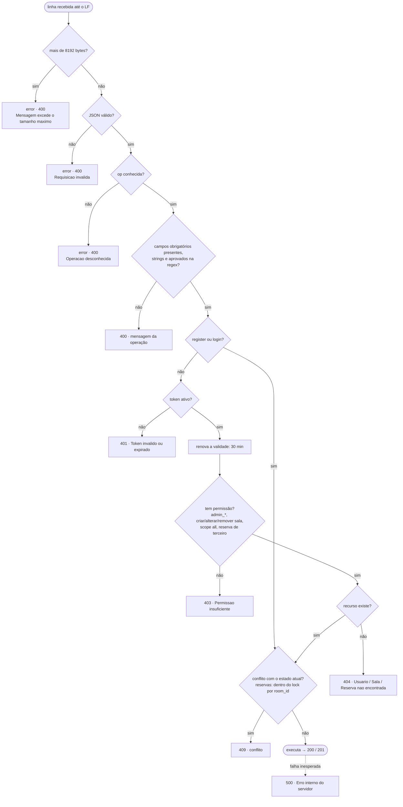
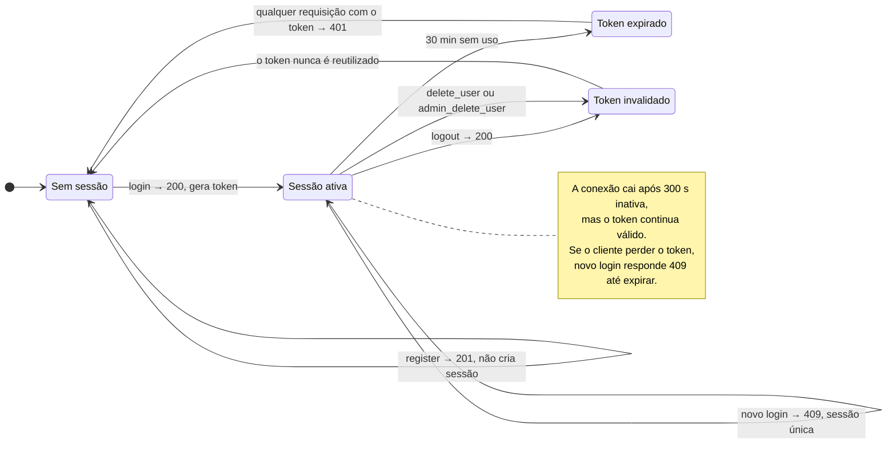
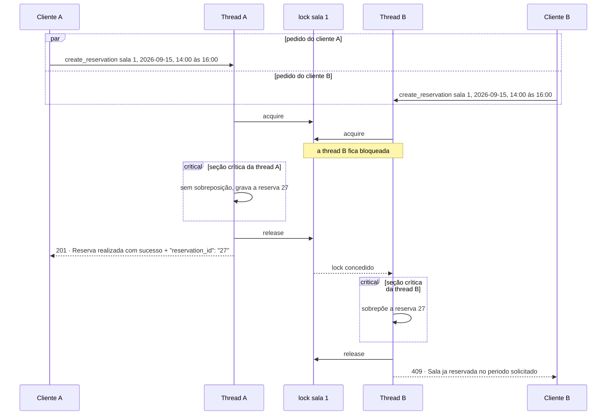

# Protocolo · Reserva de Salas

Protocolo de troca de mensagens do **Sistema Inteligente de Reserva de Salas de Reunião/Estudo em Campus**,
da disciplina de Sistemas Distribuídos (BCC, UTFPR-PG, Prof. Dr. Richard Ribeiro).
Responsáveis pelo protocolo: Pedro Silveira e Daniel Jesus.

**Documentação:** https://pedrosalvatori.github.io/protocolo-reserva-salas/

O contrato está em [`asyncapi.yaml`](asyncapi.yaml) (AsyncAPI 3.0), o equivalente do Swagger/OpenAPI para APIs
de mensagens. A página acima é montada a partir dele: editou o YAML e deu push, a documentação muda.

## Resumo

| | |
|---|---|
| Transporte | TCP. O servidor escuta numa porta digitada e usa uma thread por conexão. |
| Mensagem | 1 objeto JSON em **uma linha**, UTF-8, terminado por `\n`, até 8192 bytes. |
| Interação | Cada requisição recebe exatamente 1 resposta; o `op` da resposta é o `op` da requisição + `_response`. |
| Valores | Todos são strings: `"capacity": "12"`, `"available": "true"`. |
| Autenticação | O `login` devolve um `token` de 64 hex, que vai em toda requisição, exceto `register` e `login`. Vale 30 min sem uso. |
| Operações | 21: autenticação (3), próprio cadastro (3), administrador (4), salas (5) e reservas (6). |

## Usando a documentação

- **Busca** (tecla `/`): filtra pelo nome da operação, por campo (`room_id`), por mensagem (`Token invalido`) ou por status (`409`).
  O endereço ganha `?q=`, então dá para mandar o link da busca para o grupo.
- **Link direto:** abrir uma operação muda o endereço para `#/grupo/operacao`.
- **Try it out:** parte do exemplo da operação, valida a mensagem contra o contrato, gera o comando `nc` (Linux/macOS)
  ou PowerShell para mandar ao seu servidor e valida a resposta que ele devolveu. Cole o token do `login` em
  **Token da sessão** para ele entrar nas próximas mensagens.

## Testar o servidor de vocês

O navegador não abre conexão TCP, então o teste roda no terminal. Precisa só do Node 18 ou mais novo,
sem `npm install`:

```
git clone https://github.com/pedrosalvatori/protocolo-reserva-salas.git
cd protocolo-reserva-salas
node scripts/testar-servidor.mjs
```

O testador pergunta o IP, a porta e, se quiser, uma conta de admin já cadastrada no servidor (`email:senha`).
Também dá para passar direto:

```
node scripts/testar-servidor.mjs 127.0.0.1 5000 --admin admin@email.com:senha123
```

Ele roda mais de 70 testes e confere cada resposta contra o `asyncapi.yaml`, inclusive o texto exato da
`message`. Os testes cobrem:

- formato e erros de protocolo;
- cadastro, login, token e próprio cadastro;
- administrador e salas (precisam da conta de admin);
- reservas, incluindo duas reservas no mesmo horário ao mesmo tempo, que testa o lock por sala;
- sessão, incluindo dois logins simultâneos;
- remoção de conta.

Cada falha mostra o que veio e o que era esperado. No fim, o testador apaga os usuários, a sala e as reservas
que criou.

Para mandar mensagens à mão e ver cada resposta validada, use o modo interativo:

```
node scripts/testar-servidor.mjs 127.0.0.1 5000 --interativo
```

Nele você digita uma linha JSON ou só o nome da operação (ex.: `login`), e o testador manda o exemplo do
contrato, reaproveitando o token do último login.

## Editando o protocolo

1. Edite o `asyncapi.yaml`. No VS Code, a extensão **AsyncAPI Preview** mostra a prévia (`Ctrl+Shift+P` → `AsyncAPI: Preview`).
2. Valide com `npm install` e `npm run validate`. O script confere a estrutura com o parser oficial do AsyncAPI
   e valida todos os exemplos contra os esquemas.
3. Para ver a página na sua máquina, sirva a pasta por HTTP: `python -m http.server 8000` (ou `npm run serve`)
   e abra http://localhost:8000 (ou http://localhost:3000). Abrir o `index.html` com dois cliques não funciona:
   o navegador bloqueia os scripts em arquivos locais.
4. Faça commit e push. O GitHub Actions roda a mesma validação em todo push e pull request, e o GitHub Pages publica a página.

## Fluxos

O AsyncAPI descreve cada mensagem, mas não a ordem entre elas. Estes três diagramas cobrem isso.

### Ordem sugerida de validação no servidor

A planilha não fixa a precedência entre 400, 401, 403, 404 e 409 (pendência 6).



### Sessão e token



### Concorrência: lock por sala

Verificar a disponibilidade e gravar a reserva acontecem na mesma seção crítica, com lock por `room_id`.
O primeiro a obter o lock recebe 201; o segundo, 409.



## Pendências

Pontos que a planilha v2.0 não resolve e que afetam a conversa entre implementações de grupos diferentes:

1. **Token ausente:** a regra 2.10 manda responder 400 (campo obrigatório ausente), mas a aba *Códigos de Status* lista "token ausente" como 401.
2. **Resolvida na v2.1.** `delete_user` com senha incorreta respondia 401, o que fazia o cliente descartar um token que o servidor mantinha ativo. Agora responde 403 "Senha incorreta".
3. **`update_room` reduzindo `capacity`** abaixo dos `participants` de uma reserva futura responde 409, sem `message` definida.
4. **`scope` e `min_capacity`** aparecem nas mensagens, mas não no Dicionário. No contrato ficou `scope` ∈ {mine, all} e `min_capacity` no formato de `capacity`.
5. **`resources` em atualização:** a regra 2.11 (`""` = não alterar) não cobre arrays. `[]` esvazia a lista ou mantém?
6. **Precedência de erros** não definida. Um usuário comum que envia `create_room` inválido recebe 400 ou 403?
7. **Sessão presa:** se o cliente perder o token sem fazer logout (app fechado, travamento), um novo login responde 409 por até 30 min, e o logout exige o token perdido. A senha de confirmação errada (v2.1) e o logout depois de inatividade (v2.2) já não causam isso; o caso do app fechado continua em aberto.
8. **Maiúsculas:** a regra 2.12 diz que `user` e `email` são gravados em minúsculas, mas as regex rejeitam maiúsculas. Converter ou responder 400?
9. **Estados de sala:** uma nota na planilha cita "fechada para limpeza, ocupado", mas `room_status` só aceita `active` e `inactive`.
10. **`update_reservation` pelo admin:** `read_reservation` e `delete_reservation` dizem que o admin age sobre qualquer reserva; `update_reservation` não diz. No contrato ficou só o dono.

## Versões

### 2.3.0 (remoção de conta)

- **Remover uma conta apaga tudo dela.** `delete_user` e `admin_delete_user` apagam o cadastro, encerram a sessão
  e apagam **todas** as reservas do usuário, passadas e futuras. O `user` e o `email` ficam livres, e outra pessoa
  pode se cadastrar com os mesmos dados (201). Antes só as reservas futuras eram canceladas, e um novo cadastro com
  o mesmo `user` podia herdar as reservas antigas, inclusive ler e cancelar o que não era dele (regra 3.13).
- **Testador automático:** `node scripts/testar-servidor.mjs` (ver "Testar o servidor de vocês").

O que cada grupo precisa mudar: no servidor, apagar cadastro, sessão e todas as reservas ao remover uma conta.

### 2.2.0 (sessão e login)

Nenhuma mensagem mudou, só regras de comportamento:

- **Logout depois de 5 min parado não deixa mais a sessão presa.** O servidor fecha a conexão após 300 s sem
  mensagens. Se o cliente mandava o logout no socket fechado e descartava o token sem resposta, o servidor
  mantinha a sessão e o login seguinte respondia 409. Agora o cliente reconecta e reenvia (regra 1.11), e só
  descarta o token depois de receber o `logout_response` (regra 3.10).
- **Login simultâneo não cria duas sessões.** Checar se há sessão ativa e criar o token acontecem na mesma
  seção crítica (lock por usuário ou restrição UNIQUE no banco). Com dois logins ao mesmo tempo, um recebe
  200 e o outro 409 (regra 3.11).
- **O login não revela mais quais contas existem.** Ordem obrigatória: formato (400) → credenciais (401) →
  sessão ativa (409). O 409 só aparece com email e senha corretos (regra 3.12).

O que cada grupo precisa mudar: no servidor, a ordem do login e o lock da sessão; no cliente, reconectar e
reenviar quando o socket estiver fechado, e só descartar o token depois do `logout_response`.

### 2.1.0

- **E-mail com `.com.br` e domínios institucionais.** A regex do `email` passou a ser
  `^[a-z0-9._-]+@[a-z0-9-]+(\.[a-z0-9-]+)*\.[a-z]{2,}$`. Ela aceita domínios com vários níveis e hífen
  (`joao@empresa.com.br`, `maria@alunos.utfpr.edu.br`, `ana@meu-provedor.com.br`) e `_` ou `-` antes do `@`.
  Todo e-mail válido na 2.0 continua válido, exceto os com terminação de 1 letra (`joao@email.c`).
- **Senha errada não derruba mais a sessão.** No `delete_user`, a senha de confirmação errada respondia 401.
  O cliente, seguindo a regra do 401, descartava o token e voltava ao login, mas o servidor mantinha a sessão
  ativa, e o login seguinte respondia 409 por até 30 min. Agora a resposta é **403 "Senha incorreta"**, nada
  é removido e a sessão continua.
- **Regra nova (3.9):** 401 só quando o servidor não tem sessão ativa para aquele token, ou no `login` com
  credenciais erradas. Assim o cliente sempre pode descartar o token ao receber 401.

O que cada grupo precisa mudar: a regex de e-mail no cliente e no servidor; no servidor, responder 403
"Senha incorreta" no `delete_user`; no cliente, tratar esse 403 sem descartar o token.

### 2.0.0

Versão da planilha *Protocolo de troca de Mensagens*.

## Estrutura

```
asyncapi.yaml            contrato do protocolo (fonte da verdade)
index.html, assets/      documentação no estilo Swagger, montada no navegador a partir do YAML
assets/validator.js      validador do Try it out e do testador (o CI confere que ele concorda com o Ajv)
assets/contract.js       leitura do contrato, usada pela página e pelo testador
assets/vendor/           js-yaml e marked (licença MIT)
scripts/testar-servidor.mjs  testador do servidor por TCP (bateria completa ou modo interativo)
scripts/validate.mjs     validação da especificação e dos exemplos
.github/workflows/       CI: npm run validate em todo push e pull request
```
